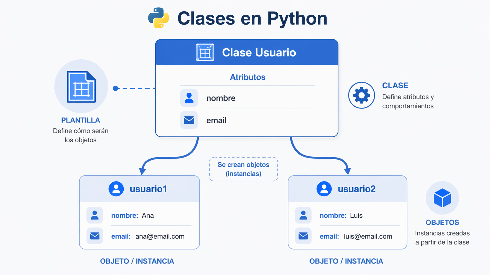
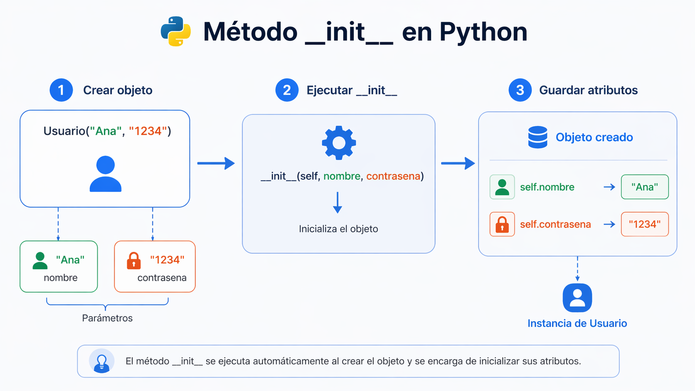
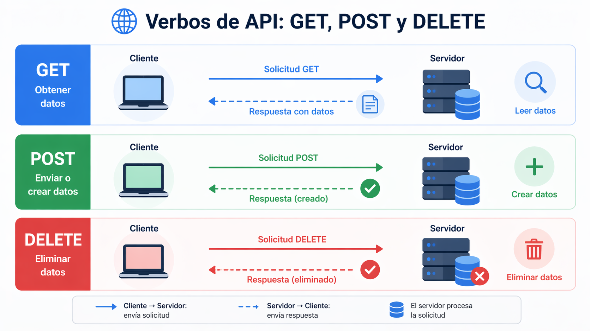
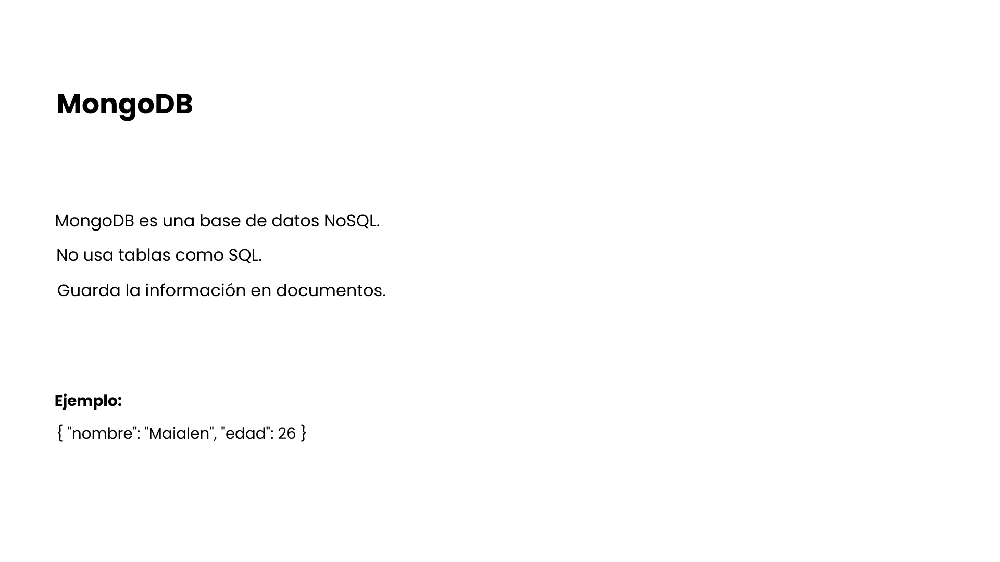
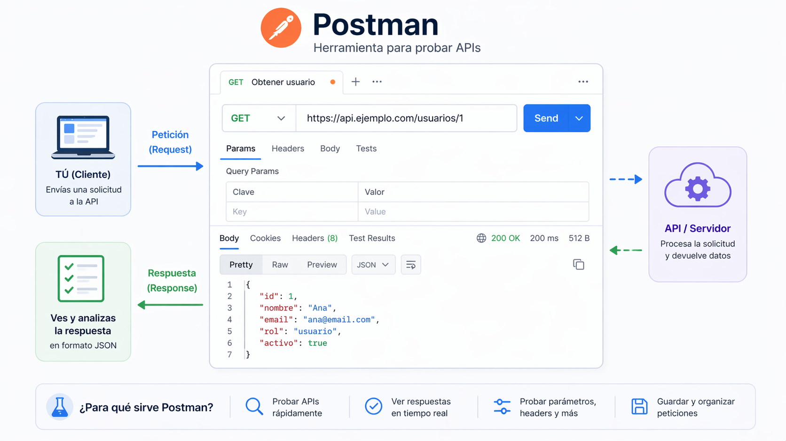
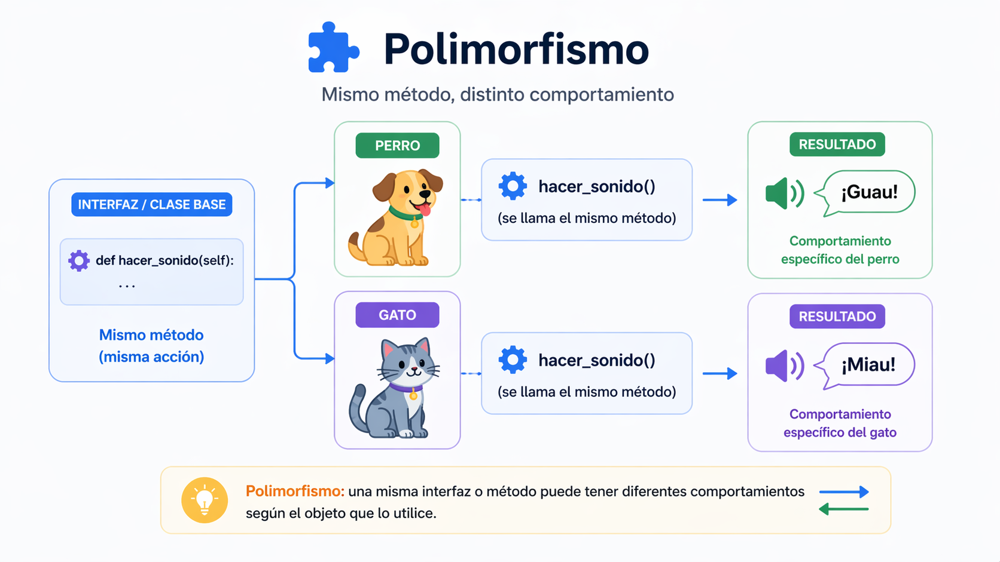
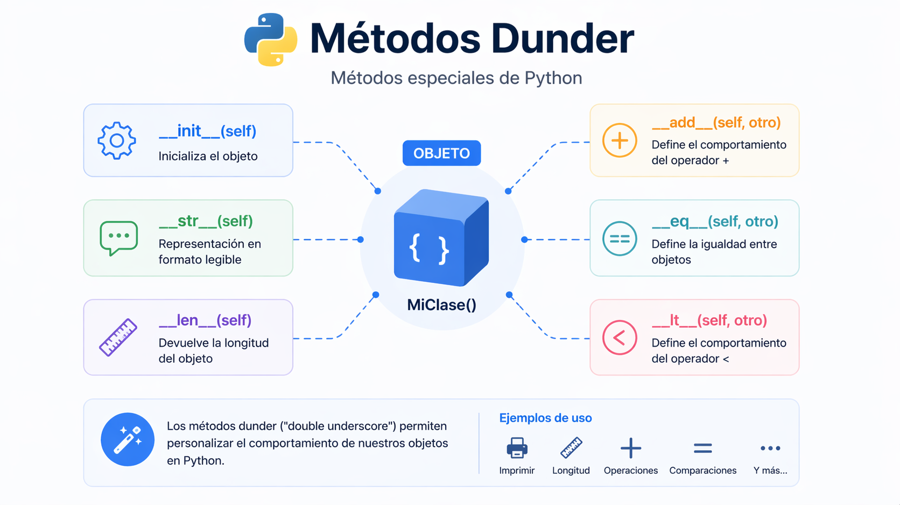
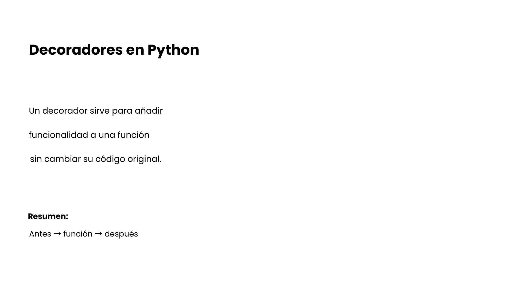

# Checkpoint 6

En este checkpoint voy a explicar varios conceptos básicos relacionados con Python, APIs y bases de datos. La idea es explicarlos de forma clara, con ejemplos sencillos, para que una persona que está empezando pueda entenderlos mejor.

---

## 1. ¿Para qué usamos clases en Python?

Las clases en Python se usan para organizar mejor el código y para crear objetos. Una clase funciona como una plantilla. A partir de esa plantilla podemos crear varios objetos con características parecidas.

Por ejemplo, si queremos trabajar con usuarios, no hace falta escribir el mismo código una y otra vez. Podemos crear una clase llamada `Usuario` y luego crear distintos usuarios a partir de ella.

Las clases son útiles porque ayudan a reutilizar código, mantenerlo más ordenado y representar cosas de la vida real dentro del programa.

### ¿Para qué sirven?

Sirven para agrupar datos y comportamientos dentro de una misma estructura. También permiten que el código sea más fácil de mantener cuando un programa empieza a crecer.

En vez de tener variables y funciones sueltas, con una clase podemos tener todo más organizado. Esto hace que el programa sea más claro y que sea más sencillo trabajar con varios objetos parecidos.

### Ejemplo

```python
class Persona:
    pass
```

### Explicación del ejemplo

En este ejemplo se crea una clase llamada `Persona`. Todavía no hace nada porque está vacía, pero sirve para ver cómo se define una clase en Python.

### Imagen



---

## 2. ¿Qué método se ejecuta automáticamente cuando se crea una instancia de una clase?

El método que se ejecuta automáticamente cuando se crea una instancia de una clase es `__init__`.

Este método se usa para inicializar los datos del objeto. Es decir, sirve para darle valores al objeto en el momento en el que lo creamos.

Gracias a `__init__`, cuando creamos un objeto podemos guardar información como un nombre, una edad, una contraseña o cualquier otro dato que necesitemos.

### ¿Para qué sirve?

Sirve para preparar el objeto desde el principio. Así, cuando creamos una instancia, ya tiene guardados los datos necesarios para poder usarla.

Es muy útil porque evita tener que asignar los valores manualmente después de crear cada objeto. De esta forma el código queda más cómodo y más ordenado.

### Ejemplo

```python
class Persona:
    def __init__(self, nombre):
        self.nombre = nombre

persona1 = Persona("Maialen")
print(persona1.nombre)
```

### Explicación del ejemplo

Aquí la clase `Persona` tiene un método `__init__` que recibe el dato `nombre`. Cuando se crea el objeto `persona1`, el valor `"Maialen"` se guarda en `self.nombre`.

Después, al hacer `print(persona1.nombre)`, se muestra ese valor en pantalla.

### Imagen



---

## 3. ¿Cuáles son los tres verbos de API?

Tres verbos muy usados en una API son `GET`, `POST` y `DELETE`.

- `GET` se usa para obtener datos.
- `POST` se usa para enviar o crear datos.
- `DELETE` se usa para eliminar datos.

Estos verbos son importantes porque indican qué acción queremos hacer cuando nos comunicamos con una API.

Por ejemplo, si una aplicación quiere ver una lista de usuarios, normalmente usaría `GET`. Si quiere crear un usuario nuevo, usaría `POST`. Si quiere borrar un usuario, usaría `DELETE`.

### ¿Para qué sirven?

Sirven para que el servidor entienda qué operación queremos realizar. No es lo mismo pedir información que crear un dato nuevo o eliminar uno que ya existe.

Estos verbos son básicos en el desarrollo web porque muchas aplicaciones modernas se comunican con servidores usando este tipo de peticiones.

### Ejemplo

```text
GET /usuarios
POST /usuarios
DELETE /usuarios/3
```

### Explicación del ejemplo

En este ejemplo:

- `GET /usuarios` pediría la lista de usuarios.
- `POST /usuarios` serviría para crear un usuario nuevo.
- `DELETE /usuarios/3` serviría para borrar el usuario con id 3.

### Imagen



---

## 4. ¿Es MongoDB una base de datos SQL o NoSQL?

MongoDB es una base de datos **NoSQL**.

Eso significa que no trabaja principalmente con tablas y filas como hacen muchas bases de datos SQL. En lugar de eso, MongoDB guarda la información en documentos, normalmente con una estructura parecida a JSON.

MongoDB se usa mucho cuando se quiere trabajar con datos flexibles o cuando no siempre todos los registros tienen exactamente la misma estructura.

Una diferencia importante es que en SQL solemos tener tablas muy definidas, mientras que en MongoDB los documentos pueden ser más flexibles.

### ¿Para qué sirve?

MongoDB sirve para guardar información de una forma más flexible. Es útil cuando los datos pueden cambiar bastante o cuando no todos los registros van a tener exactamente los mismos campos.

También se usa mucho en aplicaciones web modernas porque trabaja bien con estructuras parecidas a JSON, que son muy comunes en desarrollo web y en APIs.

### Ejemplo

```json
{
  "nombre": "Maialen",
  "edad": 24,
  "ciudad": "Donostia"
}
```

### Explicación del ejemplo

Este ejemplo muestra un documento parecido a como MongoDB guarda la información. En lugar de una fila de una tabla, aquí tenemos un documento con claves y valores.

### Imagen



---

## 5. ¿Qué es una API?

Una API es un medio que permite que dos programas se comuniquen entre sí.

Gracias a una API, una aplicación puede pedir datos o enviar información a otra aplicación o a un servidor sin necesidad de saber cómo está hecho todo internamente.

Por ejemplo, una página web del tiempo puede usar una API para pedir la temperatura actual de una ciudad. La web hace la petición y la API devuelve los datos.

Las APIs son muy importantes en el desarrollo web porque permiten conectar frontend, backend, bases de datos y servicios externos.

### ¿Para qué sirve?

Una API sirve para intercambiar información entre sistemas de forma ordenada. Gracias a ella, una parte del programa puede pedir datos a otra sin necesidad de conocer todos los detalles internos.

En desarrollo web se usa mucho porque permite que el frontend muestre información que viene del backend. También hace posible usar servicios externos, como mapas, pagos, clima o redes sociales.

### Ejemplo

Un ejemplo sencillo sería una app que muestra información del tiempo. La app no inventa los datos, sino que se conecta a una API que le devuelve la temperatura, el viento o la humedad.

### Explicación del ejemplo

La API actúa como un puente. La aplicación hace una petición y recibe una respuesta con los datos que necesita mostrar.

### Imagen


---

## 6. ¿Qué es Postman?

Postman es una herramienta que se usa para probar APIs.

Sirve para hacer peticiones como `GET`, `POST`, `PUT` o `DELETE` y ver qué responde el servidor. Es muy útil porque permite comprobar si una API funciona bien sin tener que crear una página web para probarla.

Con Postman podemos enviar datos, revisar respuestas, ver errores y probar diferentes endpoints.

Es una herramienta muy usada cuando se trabaja con backend o con APIs, porque facilita mucho las pruebas.

### ¿Para qué sirve?

Sirve para probar endpoints de una API de manera rápida y cómoda. Así podemos comprobar si una petición funciona bien, si devuelve los datos correctos o si hay algún error.

También se usa mucho antes de conectar una API con una aplicación real. De esta forma, primero se revisa si el backend responde bien y después se integra con el frontend.

### Ejemplo

Con Postman se puede hacer una petición `GET` a una URL de una API para ver si devuelve datos correctamente.

Por ejemplo, si hacemos una petición a un endpoint de usuarios, Postman puede mostrar una lista en formato JSON.

### Explicación del ejemplo

En este caso, Postman actúa como cliente. Hace la petición a la API y nos enseña la respuesta para que podamos revisar si todo funciona bien.

### Imagen



---

## 7. ¿Qué es el polimorfismo?

El polimorfismo es un concepto de programación orientada a objetos que significa que una misma acción puede comportarse de manera diferente según el objeto o el tipo de dato.

En Python esto se puede ver de forma sencilla con funciones que trabajan con distintos tipos de datos.

Por ejemplo, la función `len()` se puede usar con una cadena de texto o con una lista, pero el resultado depende del contenido que le pasemos.

El polimorfismo es útil porque hace que el código sea más flexible y reutilizable.

### ¿Para qué sirve?

Sirve para poder usar una misma idea o una misma operación con distintos tipos de datos sin tener que escribir un código completamente distinto para cada caso.

Esto ayuda a que los programas sean más flexibles y más fáciles de reutilizar. Además, hace que el código sea más limpio y menos repetitivo.

### Ejemplo

```python
print(len("hola"))
print(len([1, 2, 3, 4]))
```

### Explicación del ejemplo

En el primer caso, `len("hola")` devuelve la cantidad de letras de la palabra `"hola"`.

En el segundo caso, `len([1, 2, 3, 4])` devuelve la cantidad de elementos de la lista.

La función es la misma, pero actúa sobre tipos de datos distintos.

### Imagen



---

## 8. ¿Qué es un método dunder?

Un método dunder es un método especial de Python que tiene doble guion bajo al principio y al final de su nombre.

La palabra dunder viene de “double underscore”. Algunos ejemplos son `__init__`, `__str__` o `__len__`.

Estos métodos permiten definir comportamientos especiales en los objetos. Por ejemplo, `__init__` sirve para inicializar un objeto, y `__str__` sirve para indicar cómo se va a mostrar ese objeto cuando lo imprimimos.

Son importantes porque permiten personalizar el comportamiento de las clases.

### ¿Para qué sirve?

Sirven para que Python sepa cómo debe comportarse un objeto en ciertas situaciones. Por ejemplo, cuando se crea, cuando se imprime o cuando se usa con ciertas funciones.

Gracias a estos métodos especiales, las clases pueden funcionar de una forma más personalizada. Esto hace que los objetos sean más útiles y más fáciles de trabajar dentro de un programa.

### Ejemplo

```python
class Persona:
    def __init__(self, nombre):
        self.nombre = nombre

    def __str__(self):
        return f"Hola, soy {self.nombre}"

persona1 = Persona("Maialen")
print(persona1)
```

### Explicación del ejemplo

En este ejemplo hay dos métodos dunder:

- `__init__` inicializa el objeto con el nombre.
- `__str__` define el texto que se mostrará al imprimir el objeto.

Por eso, al hacer `print(persona1)`, Python muestra `Hola, soy Maialen`.

### Imagen



---

## 9. ¿Qué es un decorador de Python?

Un decorador en Python es una forma de modificar o ampliar el comportamiento de una función sin cambiar directamente su código.

Los decoradores se usan cuando queremos añadir algo extra antes o después de ejecutar una función. Por ejemplo, mostrar un mensaje, comprobar permisos o registrar información.

Puede parecer un poco difícil al principio, pero la idea principal es que una función puede envolver a otra función.

### ¿Para qué sirve?

Sirve para añadir funcionalidades a una función sin tener que modificar su contenido original. Esto puede ser útil cuando queremos repetir una misma acción en varias funciones.

Por ejemplo, puede servir para mostrar mensajes, controlar accesos, registrar información o ejecutar algo antes y después de una función. Así el código queda más reutilizable y mejor organizado.

### Ejemplo

```python
def mi_decorador(func):
    def envoltura():
        print("Antes de ejecutar la funcion")
        func()
        print("Despues de ejecutar la funcion")
    return envoltura

@mi_decorador
def saludar():
    print("Hola")

saludar()
```

### Explicación del ejemplo

Primero se crea el decorador `mi_decorador`. Ese decorador recibe una función y devuelve otra función llamada `envoltura`.

Después, con `@mi_decorador`, se aplica el decorador a la función `saludar()`.

Cuando ejecutamos `saludar()`, primero se muestra el mensaje de antes, luego se ejecuta la función original y al final se muestra el mensaje de después.

### Imagen



---

## Ejercicio práctico

A continuación dejo el ejercicio práctico pedido en este checkpoint. También lo he subido por separado en el archivo `ejercicio.py`.

```python
class Usuario:
    def __init__(self, nombre_usuario, contrasena):
        self.nombre_usuario = nombre_usuario
        self.contrasena = contrasena

usuario1 = Usuario("maialen", "1234")

print(usuario1.nombre_usuario)
print(usuario1.contrasena)
```

### Explicación del ejercicio

En este ejercicio se crea una clase llamada `Usuario`.

Dentro del método `__init__` se guardan dos datos: `nombre_usuario` y `contrasena`.

Después se crea un objeto llamado `usuario1` con esos dos valores.

Por último, se imprimen en pantalla para comprobar que el objeto se ha creado correctamente.

---

## Conclusión

En este checkpoint he repasado conceptos importantes de Python, APIs y MongoDB. También he realizado un ejercicio práctico usando clases y el método `__init__`.

Todo esto ayuda a entender mejor cómo se organiza el código en Python y cómo se relaciona con otras herramientas que se usan mucho en desarrollo web.
